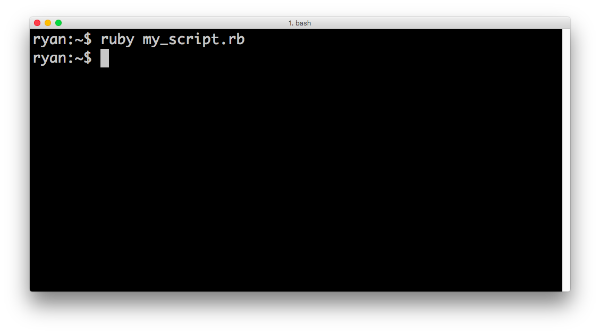
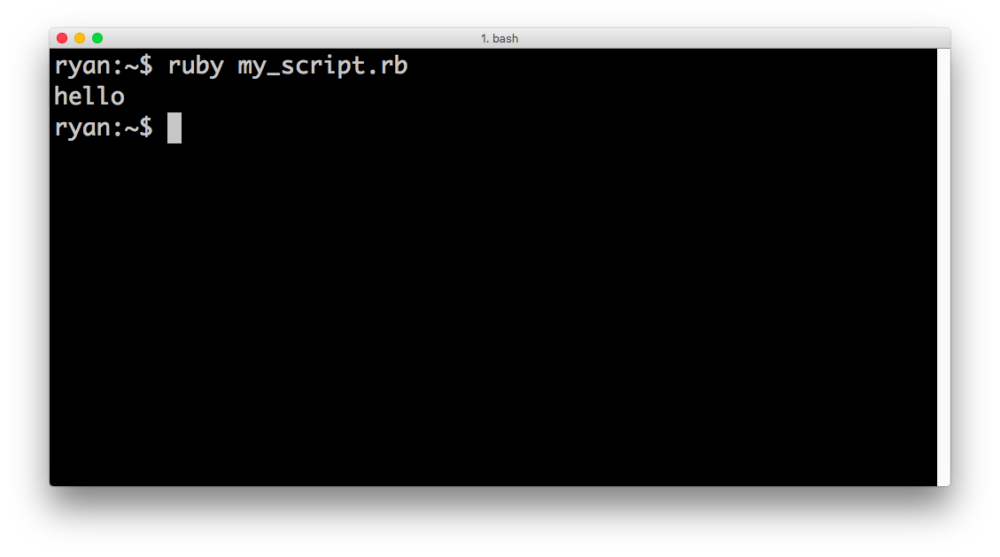
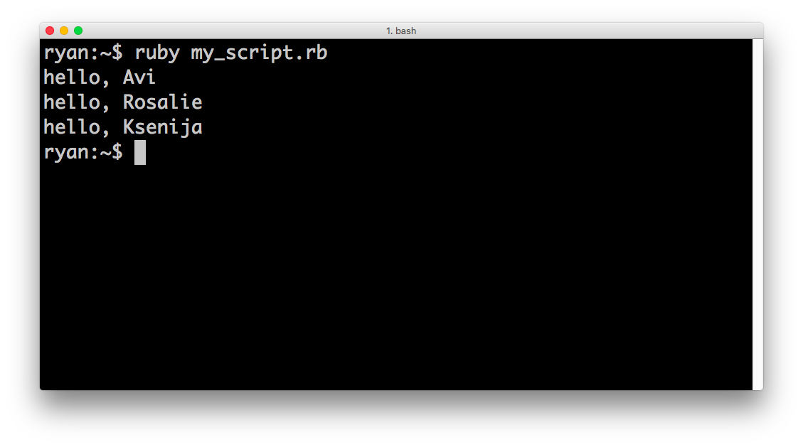

# Scripts and Methods

## Introduction

Let's start this section with a few definitions:

* **script** --> A file that contains code. We run ruby scripts from the terminal by typing `ruby script_name.rb`.
* **method** --> A function or set of commands that are bundled together. We can use scripts to define methods and execute them.

You've already used several methods. `#capitalize` and even `+` (integer addition) are ruby methods! We haven't written any scripts yet. Let's change that!

## Our first script

  * Create a new file called `my_script.rb`
  * Enter the following code into that file:

  ```ruby
    puts "hello, world!"
  ```

  * Using the terminal, navigate to the directory containing `my_script.rb`
  * Tell your computer to run the script by typing: `ruby my_script.rb`

  

Notice that we used the `puts` method to tell the computer to print the string to the terminal. Nothing is printed automatically from scripts (like it is in `pry`/`irb`). Instead, we have to tell the computer manually whenever we want it to print something.

## Our First Method

Let's change our `my_script.rb` file to instead look like this:

```ruby
  def say_hello
    puts "hello"
  end
```

In this file, we're now defining a method called `#say_hello` (the '#' in documentation is used to tell the reader that we're talking about a method). `#say_hello` is responsible for printing 'hello' to the screen.

Let's run our script.



Notice that nothing happens. Well, in our script, we *defined* a method, but we never *invoked* the method. Let's amend our script to also invoke `#say_hello`.

```ruby
  def say_hello
    puts "hello"
  end

  say_hello
```
Let's run our script again.



## Arguments

Arguments are pieces of information that we pass to methods. Let's re-write our script to instead define a method called `#say_hello_to`. This method should *accept one argument*, the name of the person to say hello to!


```ruby
  def say_hello_to(name)
    puts "hello, " + name
  end

  say_hello_to("Avi")
  say_hello_to("Rosalie")
  say_hello_to("Ksenija")
```

Let's run our new script.



**95% of JumpStart will be focused on defining methods**
