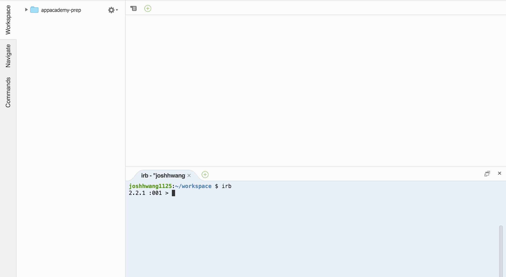

# IRB

## Introduction

The Interactive Ruby Shell, more commonly known as IRB, is one of Ruby's most popular features, especially with new developers.
You can bash out a one-liner, try a method you've just learned about, or even build a small algorithm or two without going the whole way to writing a complete program. It’s a great way of experimenting with Ruby and checking that things work. To get it up and running, all you need to do is type the following at a command line prompt:

This launches IRB and brings you into a view like this:

Now, it’s time to get started writing some Ruby!

When executing IRB, prompts are displayed as follows. Then, enter the ruby expression. An input is executed when it is syntactically complete.