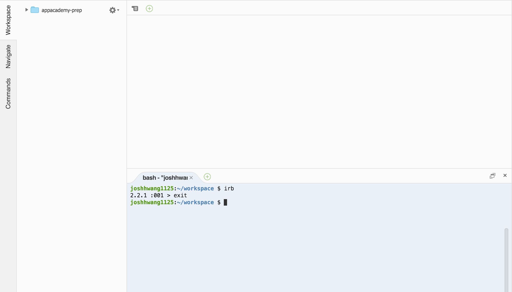
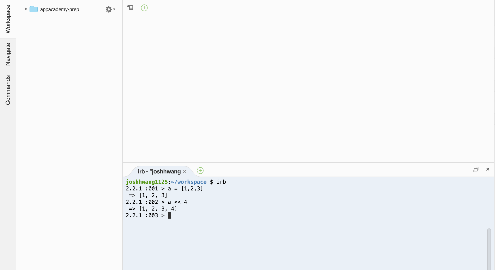
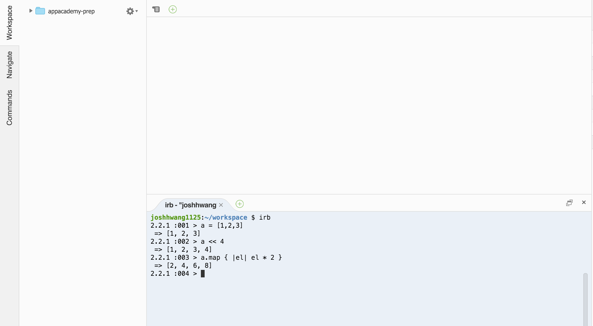
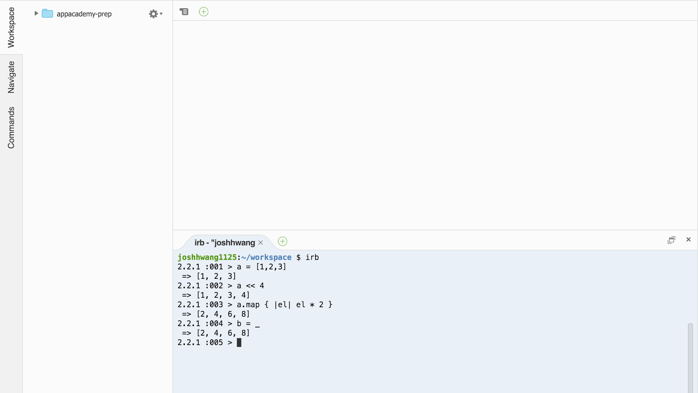
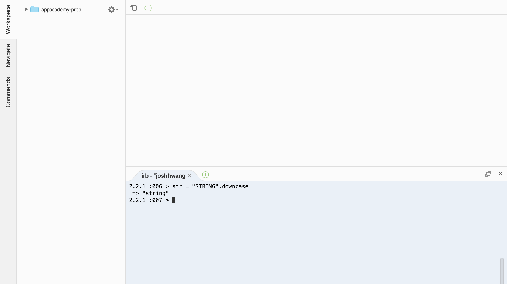
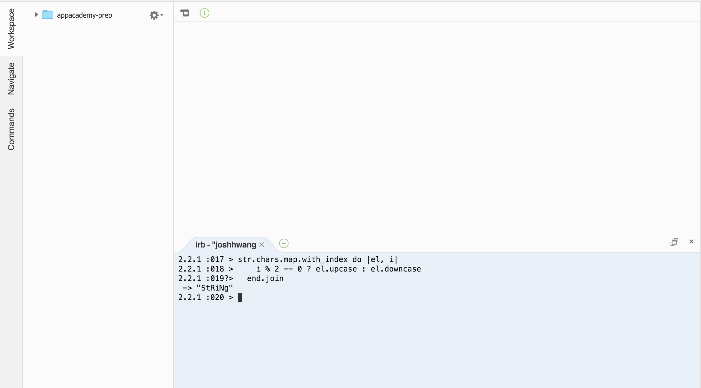
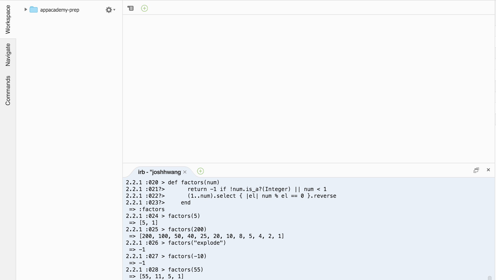

# IRB

## Introduction

The Interactive Ruby Shell, more commonly known as IRB, is one of Ruby's most popular features, especially with new developers.
You can bash out a one-liner, try a method you've just learned about, or even build a small algorithm or two without going the whole way to writing a complete program. It’s a great way of experimenting with Ruby and checking that things work.

To get it up and running, all you need to do is type the following at a command line prompt, or in our case, into the Cloud9 terminal:


This launches IRB and brings you into a view like this:


When you are finished with IRB, simply type exit to quit:



## Exercises

Now, it’s time to get started writing some Ruby! When executing IRB, prompts are displayed as follows. Then, enter the ruby expression. An input is executed when it is syntactically complete.

Let's start out by initializing an array and pushing an element into it.



As we can see in this example, IRB executes our ruby commands as we type them in line by line. We've successfully initialized our array in a variable and pushed a value into it.

Now let's try mapping over our array by invoking the map method and passing in a block:



Sometimes, we want to save the results of our ruby expression in a variable. One neat trick for accessing the return value of the most recently run expression is using underscore. We can save thus save the results of our previous command like so:



Now let's try manipulating a string. Type the following code into IRB and observe the results.



You might be wondering what to do if we want to write multiple lines of code. Fortunately, this is also very easy in IRB. When you write a line of ruby code that does not immediately evaluate, IRB prompts you to enter the next line of code. This continues until the code you have entered successfully evaluates. Try typing the following multi-liner into IRB.



The last thing we are going to try is invoking a method in IRB. Copy and paste this method, which lists the factors of a number in descending order, into IRB, and hit enter.

```ruby
  def factors(num)
    return -1 if !num.is_a?(Integer) || num < 1
    (1..num).select { |el| num % el == 0 }.reverse
  end
```

Now you can invoke the method by typing factors() into IRB and passing it any input you want! Try a couple of sample inputs and see what you get.



Play around in IRB and test out methods that you are not familiar with. Did any of the results surprise you? IRB is one of the best tools for learning the intricacies of Ruby and testing newly written code, so you definitely want to become familiar with it. Most importantly, have fun with it! A programmer's curiosity is the greatest asset he/she has in learning :)


